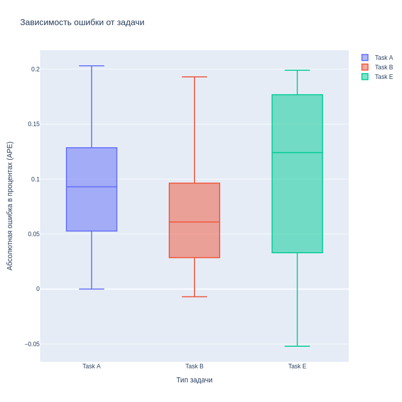

# cvrp-genetic-algorithm
Genetic Algorithm for CVRP
This project implements a genetic algorithm (GA) for solving the capacitaved vehicle routing problem (CVRP). The CVRP is a optimization problem that involves finding the optimal routes for a fleet of vehicles to serve a set of customers with known demands, subject to capacity and distance constraints. The GA is a metaheuristic that mimics the natural process of evolution to find near-optimal solutions for complex problems.

Results:

